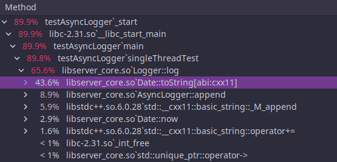
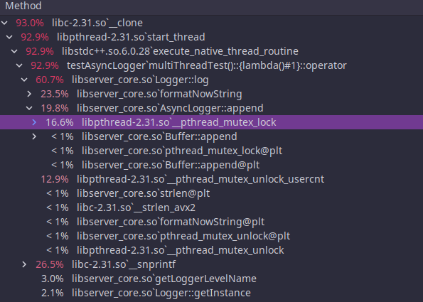

# 异步日志

## 环境

系统: OpenSUSE 15.3  
内核: 5.3.18  
内存: 16G   
磁盘: 512G SSD  
编译选项: Cmake Release 模式(-O3)

## 说明

- 采用多缓冲设计(初始状态为双缓存)
- 双队列, 写磁盘时无需加锁
- 日志量少时可定时写磁盘(默认3s)
- `FATAL` 级日志自动刷新缓存到磁盘后停止程序
- 如果没有启动异步日志, 默认的 log 处理类会将其打印到标准输出

## 性能

### 单线程

### 多线程

## 折腾过程

### 单线程 1 亿条固定字符串写入测试

直接写固定长度的字符串, 没有 log 格式化过程, 测试写磁盘的极限速度

```plain
...
flush to disk, 3 buffers
flush to disk, 3 buffers
flush to disk, 9 buffers
flush to disk, 29 buffers
flush to disk, 110 buffers
flush to disk, 607 buffers
write to cache used 4129 ms, 2421.89w log per second
writeback to disk used 10663 ms, 937.82w log per second
```

log =(append)=> Buffer =(fwrite)=> File  

由于 `fwrite` 会写到系统的缓存, 实际上相当与在写内存

  

蓝色为 Dirty Memory, 红色为 Writeback Memory

而系统缓存刷新的策略由 `/proc/sys/vm/dirty_*` 参数决定:  

`/proc/sys/vm/dirty_background_ratio` 脏页数据达到系统总内存的百分比时触发刷新, 默认`10`

`/proc/sys/vm/dirty_expire_centisecs` 脏页驻留时间超过时刷新,单位1/100s, 默认 `1500`

上面测试是内存比较充足的情况测试的, Cache 达到系统内存 10% 触发了系统的缓存刷新策略, 
开始刷数据到磁盘, 双缓存瞬间被打爆, 开始疯狂 new Buffer, 大量 Buffer 开始排队等待.
上面的数据还是比较好的情况, 内存不够的时候, 性能会迅速恶化.
new Buffer 需要内存, 内存不足就去使用 Swap 分区, 需要写磁盘; 
`fwrite` 写入 PageCache 又要新的内存, 内存不足脏页也要刷入磁盘,
磁盘的写入速度根本不可能遭得住, 10亿条测试写入直接把我笔记本搞卡死了...
对于这种突然的巨量日志冲击, muduo 的设计是, 只保留前 25 个 Buffer, 多余的日志直接丢弃.
之前看源码的时候还在想为什么要这么做, 现在算是了解了.

### `fwrite` 日志写入测试

原以为瓶颈在磁盘 I/O, 结果发现字符串格式化花费了大量时间. 
实际上日志的产生速度还达不到上面那个疯狂的程度, 目前还没看到 2 个 Buffer 不够用的情况.

如果直接使用 `fwrite` 直接写日志, 由于存在 PageCache 缓冲, 性能也很好.
每一条日志用一次 `snprintf` 只格式化了两个参数(一个是msg字符串, 一个是序号), 
平均性能如下, 用作参考值, 我们的日志尽可能达到这个速度:

```
write to cache used 2395 ms, 417.54w log per second
writeback to disk used 4156 ms, 240.62w log per second
```

### 单线程 1000w 条日志写入

因为要格式化时间和 msg, 这回速度慢多了.

```plain
write to cache used 5671 ms, 176.34w log per second
writeback to disk used 7614 ms, 131.34w log per second
```

使用 `perf` 工具分析发现日期格式化花费了大量时间, 确实对于年月日时分, 甚至秒这种都是可以重复利用的.



于是使用静态变量存储复用的年月日时分时分秒, 只在秒数更新时才格式化一次, 同时用空数据在 log 中占位,
格式化日期时避免字符串拼接操作, 尽可能减少 `snprintf` 次数. 优化之后性能翻番!

单线程测试(1000w):

```plain
write to cache used 1464 ms, 341.53w log per second
writeback to disk used 2413 ms, 207.21w log per second
```

4 线程测试(4*1000w):

```plain
write to cache used 10696 ms, 373.97w log per second
writeback to disk used 13023 ms, 307.15w log per second
```

由于多线程写日志要加锁, 对性能来说确实有些损失, 但是没有我想象中严重, 大头时间还是在做字符串格式化去了,
格式化这块感觉已经压缩到不能再压缩了, 还要提高性能只能减少锁的影响了.




