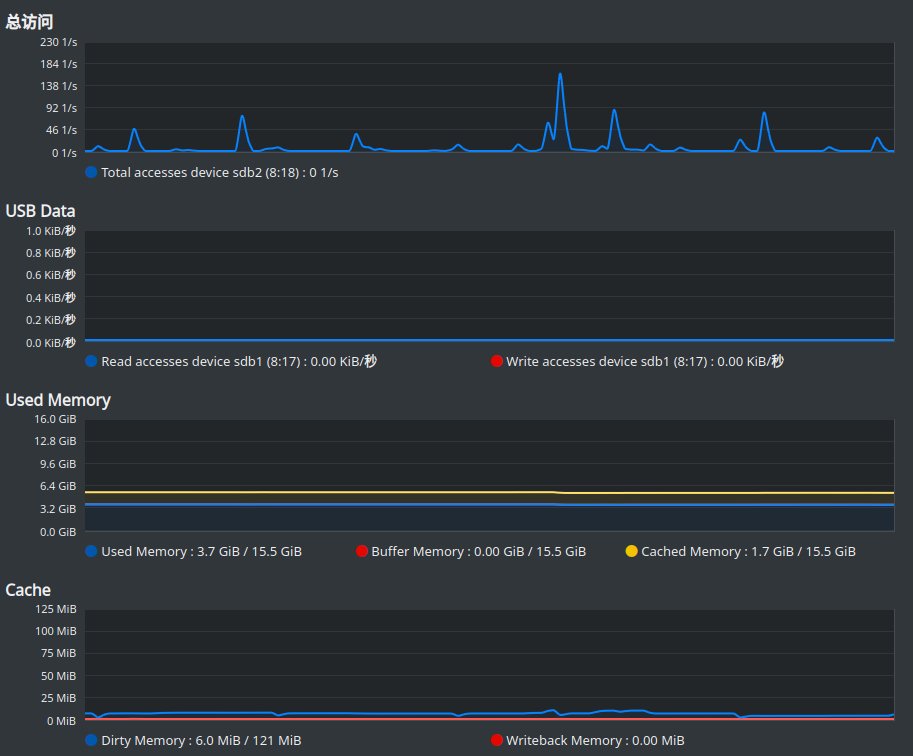

# 性能测试

## 测试环境

```
             .;ldkO0000Okdl;.                root@f117
         .;d00xl:^''''''^:ok00d;.            OS: openSUSE 15.3
       .d00l'                'o00d.          Kernel: x86_64 Linux 5.3.18-57-default
     .d0Kd'  Okxol:;,.          :O0d.        Uptime: 11h 37m
    .OKKKK0kOKKKKKKKKKKOxo:,      lKO.       Packages: 2709
   ,0KKKKKKKKKKKKKKKK0P^,,,^dx:    ;00,      Shell: bash 4.4.23
  .OKKKKKKKKKKKKKKKKk'.oOPPb.'0k.   cKO.     CPU: Intel Core i7-9750H @ 12x 4.5GHz
  :KKKKKKKKKKKKKKKKK: kKx..dd lKd   'OK:     GPU: NVIDIA GeForce GTX 1650
  dKKKKKKKKKKKOx0KKKd ^0KKKO' kKKc   dKd     RAM: 6293MiB / 15888MiB
  dKKKKKKKKKKKK;.;oOKx,..^..;kKKK0.  dKd    
  :KKKKKKKKKKKK0o;...^cdxxOK0O/^^'  .0K:    
   kKKKKKKKKKKKKKKK0x;,,......,;od  lKk     
   '0KKKKKKKKKKKKKKKKKKKKK00KKOo^  c00'     
    'kKKKOxddxkOO00000Okxoc;''   .dKk'      
      l0Ko.                    .c00l'       
       'l0Kk:.              .;xK0l'         
          'lkK0xl:;,,,,;:ldO0kl'            
              '^:ldxkkkkxdl:^'              

```

上面是我笔记本的配置, 硬盘是一块普通的 512G SSD.

为了防止 open files 限制和 Page Cache 状态的影响, 我们将用户的打开文件数量限制提升到 100w

```bash
ulimit -n 1000000
```

同时每次测试前, 使用 `sync` 同步脏页数据到磁盘, 通过 `echo 3 > /proc/sys/vm/drop_caches`
丢弃缓存数据. 尽量保持系统处于稳定和统一的初始条件:




## Nginx 测压

我们先测试 `nginx` 的性能, 用作对比. `nginx` 配置 `worker_processes` 为 `8`, 启用了 `access_log`.

`GET /` 响应为(总长度246B):

```
HTTP/1.1 200 OK
Accept-Ranges: bytes
Connection: keep-alive
Content-Length: 21
Content-Type: text/html
Date: Wed, 13 Oct 2021 05:03:45 GMT
ETag: "6108ca6f-15"
Last-Modified: Tue, 03 Aug 2021 04:47:43 GMT
Server: nginx/1.21.1

<h1>Hello Nginx</h1>

```

每次请求只写一条日志, 格式:

```
172.17.0.1 - - [13/Oct/2021:05:31:00 +0000] "GET / HTTP/1.1" 200 21 "-" "-" "-"
```

之前是在 Docker 下做的测试, 为了准确起见, 物理机器装了 nginx 重新测试. 

### `wrk -t8 -c1k -d30s --latency http://127.0.0.1:80`

```
Running 30s test @ http://127.0.0.1:80
  8 threads and 1000 connections
  Thread Stats   Avg      Stdev     Max   +/- Stdev
    Latency     9.92ms   11.26ms 247.52ms   93.17%
    Req/Sec    15.23k     1.93k   34.13k    73.99%
  Latency Distribution
     50%    6.92ms
     75%    8.23ms
     90%   15.29ms
     99%   68.56ms
  3632331 requests in 30.07s, 0.87GB read
Requests/sec: 120795.53
Transfer/sec:     29.60MB
```


### `wrk -t8 -c5k -d30s --latency http://127.0.0.1:80`

```
Running 30s test @ http://127.0.0.1:80
  8 threads and 5000 connections
  Thread Stats   Avg      Stdev     Max   +/- Stdev
    Latency    26.15ms   68.47ms   1.83s    93.36%
    Req/Sec    14.95k     2.41k   32.16k    71.39%
  Latency Distribution
     50%    7.25ms
     75%   12.76ms
     90%   73.56ms
     99%  143.54ms
  3557760 requests in 30.10s, 0.85GB read
  Socket errors: connect 0, read 0, write 0, timeout 205
Requests/sec: 118197.34
Transfer/sec:     28.96MB
```

此时已经出现 `timeout`(默认1s), 后面经过我反复试探压测, 得到的的 QPS 大概是 12w 的样子


## Jerry 测压

为了与 nginx 对比, worker 线程同样设为 `8`, `GET /` 时读取本地文件, 响应为(总长度251B):


```
HTTP/1.1 200 OK
Connection: keep-alive
Content-Length: 128
Content-Type: text/html;charset=UTF-8
Server: JerryServer/0.1.0

<html>
    <head>
        <title>Jerry</title>
    </head>
    <body>
        <h1>Hello, This is Jerry</h1>
    </body>
</html>
```


启用异步日志, 一次请求同样记录一条, 格式:

```
2021-10-13 19:07:51.000972 [INFO] HttpServer.cc:47 - 127.0.0.1 - "/ HTTP/1.1" 200 128
```

### `wrk -t8 -c1k -d30s --latency http://127.0.0.1:8081`

```
Running 30s test @ http://127.0.0.1:8081
  8 threads and 1000 connections
  Thread Stats   Avg      Stdev     Max   +/- Stdev
    Latency     5.14ms    4.99ms 246.91ms   96.60%
    Req/Sec    24.62k     3.28k   59.52k    76.91%
  Latency Distribution
     50%    4.61ms
     75%    5.27ms
     90%    6.81ms
     99%   17.08ms
  5871466 requests in 30.10s, 1.41GB read
Requests/sec: 195063.83
Transfer/sec:     47.81MB
```

惊了, 居然比 nginx 的 QPS 大了一倍! 延迟也小很多!

### `wrk -t8 -c5k -d30s --latency http://127.0.0.1:8081`

```
Running 30s test @ http://127.0.0.1:8081
  8 threads and 5000 connections
  Thread Stats   Avg      Stdev     Max   +/- Stdev
    Latency    27.20ms   30.26ms   1.70s    99.36%
    Req/Sec    23.44k     2.46k   60.99k    80.13%
  Latency Distribution
     50%   25.16ms
     75%   28.04ms
     90%   33.50ms
     99%   50.41ms
  5570971 requests in 30.07s, 1.33GB read
Requests/sec: 185277.13
Transfer/sec:     45.41MB
```

### `wrk -t8 -c10k -d30s --latency http://127.0.0.1:8081`

```
Running 30s test @ http://127.0.0.1:8081
  8 threads and 10000 connections
  Thread Stats   Avg      Stdev     Max   +/- Stdev
    Latency    63.48ms   20.00ms 970.52ms   91.54%
    Req/Sec    19.41k     1.96k   43.94k    80.43%
  Latency Distribution
     50%   64.58ms
     75%   68.20ms
     90%   73.89ms
     99%   99.60ms
  4617041 requests in 30.10s, 1.11GB read
Requests/sec: 153388.31
Transfer/sec:     37.59MB
```

### `wrk -t8 -c20k -d30s --latency http://127.0.0.1:8081`

```
Running 30s test @ http://127.0.0.1:8081
  8 threads and 20000 connections
  Thread Stats   Avg      Stdev     Max   +/- Stdev
    Latency   111.70ms   38.45ms   1.95s    85.92%
    Req/Sec    21.96k     4.28k   56.36k    89.43%
  Latency Distribution
     50%  108.71ms
     75%  123.33ms
     90%  144.21ms
     99%  195.46ms
  4733903 requests in 30.10s, 1.13GB read
  Socket errors: connect 0, read 0, write 0, timeout 46
Requests/sec: 157265.11
Transfer/sec:     38.54MB
```

此时出现 `timeout`, 经过多次测试, QPS 大概在 16~19w.
